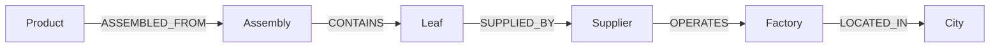

# Cascade

A supply-chain risk console for a fictional electronics OEM, **Helios**. Pick a city, factory, or supplier and see which finished products slip if that node goes dark.

Built for the Wexa AI CognoDB take-home: Next.js, the official Neo4j JavaScript driver, parameterized Cypher, and a nested bill of materials that is awkward to query in SQL.

## Why a graph database?

Helios does not have a flat parts list. A Phone Pro is assembled from a display assembly, which contains cover glass, which is supplied by one factory in Harrodsburg. That is a **variable-depth tree** (the BOM) joined to a **network** (suppliers, plants, cities).

The question the app answers is:

> If a tornado hits Harrodsburg, which SKUs miss their ship date?

In a relational schema you would keep `products`, `components`, `bom_edges`, `suppliers`, `factories`, and `cities`, then either:

- unrolling N self-joins on `bom_edges` and hoping the BOM never goes deeper, or
- a recursive CTE from every finished good down to every leaf, then more joins out to geography.

In CognoDB it is one pattern:

```cypher
MATCH (city:City {id: $cityId})<-[:LOCATED_IN]-(factory)
      <-[:OPERATES]-(supplier)<-[:SUPPLIED_BY]-(part)
MATCH (product:Product)-[:ASSEMBLED_FROM|CONTAINS*1..8]->(part)
RETURN DISTINCT product, part, supplier, factory
```

The `*1..8` hop is the point. Depth is data, not schema. Shared parts (the same cover glass in phones, tablets, and laptops) fan out naturally. That is what a graph is for.

## Data model



**Nodes**

- `Product` — finished SKU (`name`, `category`, `asp`)
- `Component` — any BOM node, assembly or leaf (`name`, `category`, `criticality`)
- `Supplier` — (`name`, `tier`)
- `Factory` — (`name`)
- `City` — (`name`, `country`, `hazard`)

**Relationships**

- `(:Product)-[:ASSEMBLED_FROM {qty}]->(:Component)`
- `(:Component)-[:CONTAINS {qty}]->(:Component)` — nested BOM
- `(:Component)-[:SUPPLIED_BY {leadDays, soleSource}]->(:Supplier)`
- `(:Supplier)-[:OPERATES]->(:Factory)`
- `(:Factory)-[:LOCATED_IN]->(:City)`

Seeded graph (after `npm run seed`): 15 products, ~55 components across 3–4 BOM levels, 17 suppliers, 17 factories, 11 cities. Cover glass is a sole-source part in Harrodsburg; every Helios SoC die is fabbed in Tainan. Those two cities are the demo.

## Setup

### 1. CognoDB Cloud

1. Sign up at [console.cognodb.com/signup](https://console.cognodb.com/signup) (free tier, no card).
2. Create a free **c0** instance and pick a region.
3. Copy the `bolt+s://<instance-id>.databases.cognodb.cloud` URI and the generated password for user `cognodb`. The password is shown once.

### 2. App

```bash
git clone <this-repo>
cd cascade
npm install
cp .env.example .env.local
```

Fill in `.env.local`:

```
COGNODB_URI=bolt+s://<instance-id>.databases.cognodb.cloud
COGNODB_USER=cognodb
COGNODB_PASSWORD=<the-password>
```

If the driver rejects the certificate (CognoDB uses its own CA), switch the URI scheme to `bolt+ssc://` — same host, documented on [cognodb.com/docs](https://cognodb.com/docs).

### 3. Seed and run

```bash
npm run seed
npm run dev
```

Open [http://localhost:3000](http://localhost:3000). `npm run seed` **wipes** the instance (`MATCH (n) DETACH DELETE n`) and reloads Helios. Use a dedicated free instance, not a graph you care about.

## Main queries

All of these live in `src/lib/queries.ts`. Parameters are always passed through the official driver — never concatenated into Cypher.

### Blast radius (multi-hop, 4–6 hops)

Used by **Simulate**. Walks from a city (or factory, or supplier) through the plant and vendor into leaf parts, then **up** a variable-length BOM to finished goods.

```cypher
MATCH (city:City {id: $targetId})<-[:LOCATED_IN]-(factory:Factory)
      <-[:OPERATES]-(supplier:Supplier)
      <-[sb:SUPPLIED_BY]-(part:Component)
MATCH path = (product:Product)-[:ASSEMBLED_FROM|CONTAINS*1..8]->(part)
RETURN product, part, supplier, factory, city, nodes(path)
```

A relational engine would recurse the BOM per product, join suppliers, filter by city, and union the SKUs. Here the city is the start node.

### Choke points (awkward in SQL)

Used by **Choke points**. Components with exactly one supplier, then every product that contains them at any depth.

```cypher
MATCH (c:Component)-[:SUPPLIED_BY]->(s:Supplier)
WITH c, collect(s) AS suppliers
WHERE size(suppliers) = 1
MATCH (c)-[:SUPPLIED_BY]->(s)-[:OPERATES]->(:Factory)-[:LOCATED_IN]->(city)
OPTIONAL MATCH (p:Product)-[:ASSEMBLED_FROM|CONTAINS*1..8]->(c)
RETURN c, s, city, collect(DISTINCT p.name)
```

### Product geographic exposure

Used by **product pages**. Same variable-length descent, then out to every city on the path.

## UI

- **Overview** — graph size, cities ranked by SKUs at risk, each product’s city and sole-source counts
- **Simulate** — pick City / Factory / Supplier, run the blast-radius query, inspect the shockwave graph and delayed SKUs
- **Choke points** — sole-source parts and the products that depend on them
- **Product** — one SKU’s BOM geography

Loading, empty (unseeded graph), and database-unreachable states are handled on every screen. Connection details are read from the environment and never committed.

## Screenshots

After the instance is seeded, capture:

1. Overview with city blast-radius cards
2. Simulate → Harrodsburg (cover glass) with the graph in red/amber
3. Choke points list
4. Helios Phone Pro exposure page

Place PNGs in `docs/` if you add them to this README:

```
docs/overview.png
docs/simulate-harrodsburg.png
docs/choke-points.png
docs/product-phone-pro.png
```

## Hosted demo

Deploy on [Vercel](https://vercel.com): import the GitHub repo, add `COGNODB_URI`, `COGNODB_USER`, `COGNODB_PASSWORD` as project env vars, deploy. Keep the CognoDB instance running until Wexa has reviewed.

Demo URL: _add after deploy_

## Screen recording

See [docs/demo-script.md](docs/demo-script.md) for a 60–90 second shot list.

## Project layout

```
scripts/graph-data.ts    Helios BOM, suppliers, cities
scripts/seed.ts          Idempotent wipe + MERGE load
src/lib/neo4j.ts         Official driver singleton, parameterized sessions
src/lib/queries.ts       Cypher
src/app/api/*            Node runtime routes
src/app/simulate         Disruption UI
src/components/GraphCanvas.tsx
```

## Assignment notes

- Official Neo4j JS driver, Bolt 5, user `cognodb`
- No secrets in git (`.env*` ignored, `.env.example` committed)
- Graceful 503 when CognoDB is down or env is missing
```
